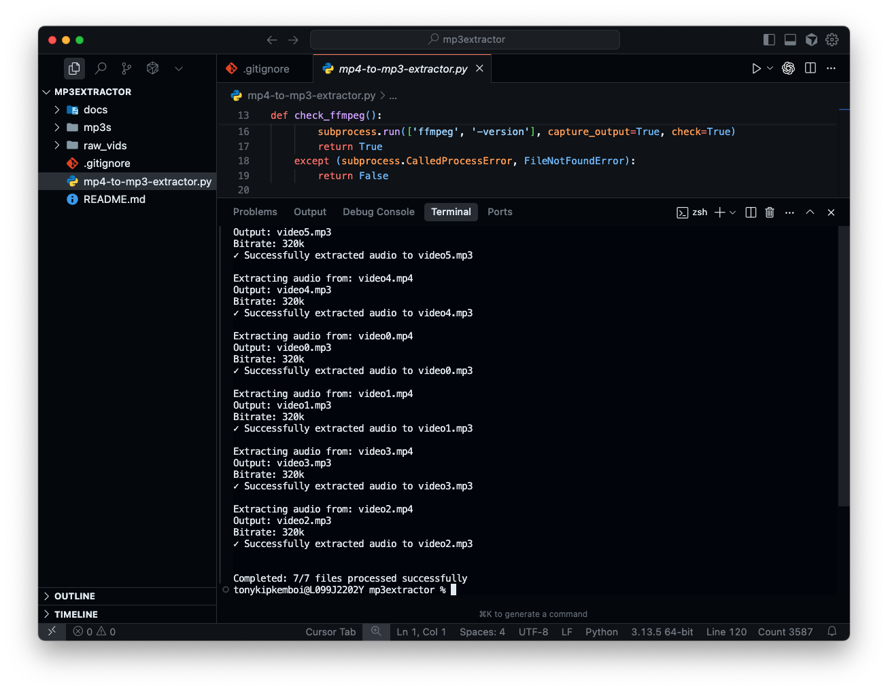

## MP4 → MP3 Audio Extractor

Extract high‑quality MP3 audio from MP4 videos using ffmpeg. Works on single files, folders, or glob patterns, and lets you control bitrate and sample rate for great results every time.

### Terminal Output Example



---

### Features
- **High quality MP3**: LAME encoder (`libmp3lame`) with `-q:a 0` and configurable bitrate (default `320k`).
- **Batch and single-file modes**: Process a single file, an entire folder, or a glob pattern.
- **Customizable output**: Choose output file name or output directory.
- **Cross-platform**: macOS, Linux, and Windows (with ffmpeg installed).

### Prerequisites
- **Python**: 3.8+
- **ffmpeg**: Required and must be on your PATH

Install ffmpeg:
- **macOS (Homebrew)**:
```bash
brew update && brew install ffmpeg
```
- **Ubuntu/Debian**:
```bash
sudo apt update && sudo apt install -y ffmpeg
```
- **Windows (Chocolatey)**:
```powershell
choco install ffmpeg
```
- **Windows (Scoop)**:
```powershell
scoop install ffmpeg
```

### Quick start
From the project root:

- **Extract a single file**
```bash
python3 mp4-to-mp3-extractor.py raw_vids/video0.mp4 -o mp3s/video0.mp3
```

- **Extract all MP4s in a folder to an output folder**
```bash
python3 mp4-to-mp3-extractor.py raw_vids -o mp3s -b 320k
```

- **Extract using a glob pattern (quote the pattern in zsh)**
```bash
python3 mp4-to-mp3-extractor.py "raw_vids/*.mp4" -o mp3s -s 48000
```

- **Make the script directly executable (optional)**
```bash
chmod +x mp4-to-mp3-extractor.py
./mp4-to-mp3-extractor.py raw_vids -o mp3s
```

### Command reference
```text
usage: mp4-to-mp3-extractor.py [-h] [-o OUTPUT] [-b BITRATE] [-s SAMPLE_RATE] input
```

- **input**: MP4 file, directory, or pattern (e.g., `*.mp4`)
- **-o, --output**: Output file (single input) or output directory (batch)
- **-b, --bitrate**: Audio bitrate (default: `320k`)
- **-s, --sample-rate**: Sample rate in Hz (e.g., `44100`, `48000`)

### Examples
- **Custom output file name**
```bash
python3 mp4-to-mp3-extractor.py raw_vids/video1.mp4 -o mp3s/lecture1.mp3
```

- **Directory input with custom bitrate**
```bash
python3 mp4-to-mp3-extractor.py raw_vids -o mp3s -b 256k
```

- **Single file with specific sample rate**
```bash
python3 mp4-to-mp3-extractor.py raw_vids/video2.mp4 -s 48000 -o mp3s/video2-48k.mp3
```

### How it works
Under the hood, the script shells out to `ffmpeg` and encodes audio with:
- `-vn` (ignore video)
- `-acodec libmp3lame`
- `-b:a <bitrate>` (default `320k`)
- `-q:a 0` (highest VBR quality)

### Project structure
```text
mp3extractor/
  raw_vids/            # place your .mp4 videos here
  mp3s/                # extracted .mp3 files will go here (when using -o)
  mp4-to-mp3-extractor.py
  README.md
```

### Troubleshooting
- **ffmpeg not found**: Ensure ffmpeg is installed and on your PATH (see Prerequisites).
- **No MP4 files found**: For glob patterns in `zsh`, wrap the pattern in quotes (e.g., `"*.mp4"`).
- **Permission denied**: If running directly (`./mp4-to-mp3-extractor.py`), make it executable: `chmod +x mp4-to-mp3-extractor.py`.
- **Spaces in paths**: Quote your input/output paths (e.g., `"raw vids/video 1.mp4"`).

### Notes
- When the input is a directory or glob pattern, `-o/--output` should be a directory.
- When the input is a single file, `-o/--output` may be a file path or omitted (defaults to same name with `.mp3`).

---

Happy extracting! 🎧
